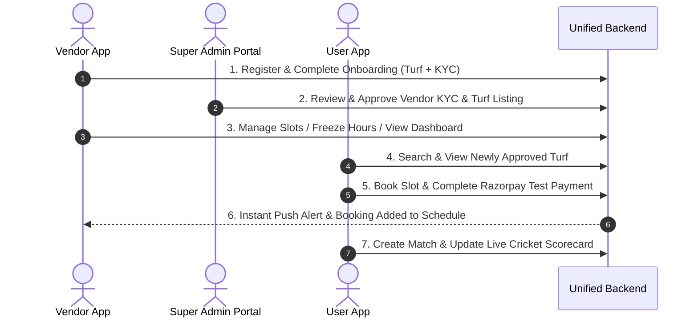

# 🏟️ Turf Booking Ecosystem — End-to-End Live Data Testing Guide

This guide walks you through testing the entire live data cycle across the **Unified REST Backend**, **Super Admin Management Portal**, **Turf Vendor Mobile App**, and **Turf User Mobile App**.

---

## ⚡ Prerequisites & Server Startup

### 1. Start the Common Backend
```powershell
cd c:\Turf-Booking-App-Official\server
npm run dev
```
* **API Base:** `http://localhost:5000/api/v1`
* **Health Check:** `http://localhost:5000/api/v1/health`
* **Super Admin Portal:** `http://localhost:5000/admin`

### 2. Android Hardware / Emulator Port Mapping
If testing on an Android device or emulator connected via USB, run this once:
```powershell
adb reverse tcp:5000 tcp:5000
```

---

## 🔄 Live Data Testing Workflow Overview



---

## 🚀 Step-by-Step Testing Procedure

### 🟢 Phase 1: Test Turf Vendor App (Onboarding & Turf Setup)

1. **Launch Vendor App:**
   ```powershell
   cd c:\Turf-Booking-App-Official\TurfVendorApp
   npm run android
   ```
2. **Register a New Vendor Account:**
   * Tap **Sign Up** $\rightarrow$ Enter Name, Email, Mobile Number, and Password.
   * Tap **Register**.
3. **Complete the 3-Step Onboarding Wizard:**
   * **Step 1 (Turf Information):** Enter Turf Name (e.g. *"Chennai Super Arena"*), select sports (Football, Cricket), set Hourly Price (e.g. `₹800`), choose Operating Hours (`06:00` to `23:00`), and pick a turf image from gallery.
   * **Step 2 (Owner Identity):** Upload **Aadhaar** and **PAN Card** images.
   * **Step 3 (Turf Verification):** Upload **GST Certificate** and **EB Bill** images.
   * **Step 4 (Partner Subscription):** Select a subscription plan (e.g. *Pro Annual*) and continue.
4. **Result:** The Vendor App displays *"Application Under Review"*.

---

### 🔵 Phase 2: Test Super Admin Portal (Review & Approval)

1. **Open the Super Admin Web Portal:**
   * Open your browser and navigate to: **`http://localhost:5000/admin`**
2. **Login with Super Admin Credentials:**
   * **Email:** `admin@zuna.com`
   * **Password:** `Cgs@001a`
3. **Approve Vendor & Turf:**
   * Go to **"Vendors"** in the sidebar.
   * Locate the pending vendor request $\rightarrow$ Click **Review**.
   * Click **Approve KYC & Turf**.
4. **Instant Vendor Sync:**
   * Reopen or pull-to-refresh the **Vendor App**.
   * The Vendor App instantly unlocks the full **Vendor Dashboard** with today's schedule, slot management, and revenue counters.

---

### 🟣 Phase 3: Test Turf User App (Discovery & Slot Booking)

1. **Launch User App:**
   ```powershell
   cd c:\Turf-Booking-App-Official\TurfUserApp
   npm run android
   ```
2. **Register / Login:**
   * Create a new customer profile or log in.
3. **Explore Feed & Search:**
   * The newly approved turf (*"Chennai Super Arena"*) appears live on the **Home Screen** and **Explore Screen** with price tags, sports chips, and distance badge.
4. **View Turf Details:**
   * Tap the turf card $\rightarrow$ View ground details, pitch specifications, amenities, and map location directions.
5. **Slot Reservation & Razorpay Checkout:**
   * Tap **Book Slot** $\rightarrow$ Select Date (*Today*) $\rightarrow$ Choose a time slot (e.g. *07:00 PM - 08:00 PM*).
   * Tap **Proceed to Pay** $\rightarrow$ Razorpay test modal opens.
   * Choose Test Payment (Card / UPI / NetBanking) $\rightarrow$ Complete payment.
6. **Booking Confirmation Pass:**
   * The app generates a **digital booking pass** with booking ID, match details, QR code, and WhatsApp share button.

---

### 🟡 Phase 4: Test Real-Time Synchronization & Vendor Alerts

1. **Verify Vendor App Schedule:**
   * Open **Vendor App** $\rightarrow$ Go to **Bookings** or **Today's Schedule**.
   * The `07:00 PM - 08:00 PM` slot status turns to **Booked (Green)** with customer name and payment confirmed.
2. **Verify User "My Bookings":**
   * Open **User App** $\rightarrow$ Navigate to **Bookings Tab**.
   * The confirmed pass is listed under **Upcoming**.
3. **Test Cricket Tournament & Live Scorecard:**
   * In User App, tap **Quick Action $\rightarrow$ Create Match Room**.
   * Choose sport (Cricket), set overs (6 overs), and click **Create**.
   * Open the **Scorecard Keypad** $\rightarrow$ Tap runs (1, 4, 6, Wicket).
   * Score updates save with offline-first speed and sync to cloud matches.

---

## 🛠️ Verification Endpoints Cheat Sheet

| Feature | URL / Endpoint | Method | Expected Output |
| :--- | :--- | :---: | :--- |
| **Backend Health** | `http://localhost:5000/api/v1/health` | `GET` | `{"success": true, "data": {"status": "ok"}}` |
| **Google Places Search** | `http://localhost:5000/api/v1/places/autocomplete?input=Chennai` | `GET` | Returns Chennai sports hubs |
| **Super Admin Portal** | `http://localhost:5000/admin` | `GET` | Super Admin Web UI (200 OK) |
| **Active Turfs Feed** | `http://localhost:5000/api/v1/turfs` | `GET` | List of approved live turfs |
| **Vendor Login** | `http://localhost:5000/api/v1/auth/login` | `POST` | Returns session JWT + vendor profile |
| **User Login** | `http://localhost:5000/api/v1/auth/login` | `POST` | Returns session JWT + user profile |
