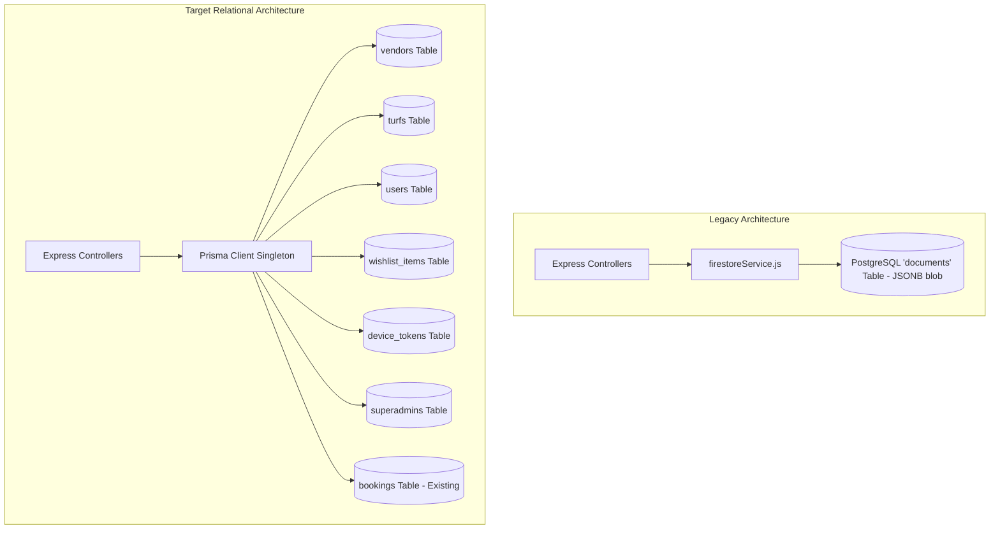

# PostgreSQL Relational Migration Workflow & Audit

This document details the complete end-to-end migration workflow, database design, completed actions, verified metrics, and upcoming cutover steps for the Turf Booking platform.

---

## 1. Executive Summary & Objective

The goal of this initiative is to move the platform's core entities (**Turfs**, **Vendors**, **Users**, **Wishlists**, **Device Tokens**, and **SuperAdmins**) out of the unstructured JSON `documents` table into dedicated, strongly typed PostgreSQL relational tables managed via Prisma on Railway.

### Core Safety Guarantees
* **Strictly Additive**: The existing `documents`, `bookings`, and `slot_overrides` tables are never dropped, truncated, or structurally altered.
* **Zero Downtime & Idempotent**: Backfills and migrations use conditional logic and upserts (`ON CONFLICT DO UPDATE`), allowing safe re-execution.
* **Credential Isolation**: Passwords, tokens, and database URLs are never logged, re-hashed blindly, or exposed in client payloads.
* **Step-by-Step Approval**: Each phase requires explicit verification before code or database changes are applied.

---

## 2. Architecture Comparison

---

## 3. Step-by-Step Progress & Status

| Step | Phase | Status | Verification & Deliverables |
| :--- | :--- | :--- | :--- |
| **Step 1** | **Inspection & Field Audit** | ✅ **Completed** | Inspected live Railway `documents` table. Identified real JSON schema for `turf_arena_01` and `vendor_vendor_turf_com`. Audited all controller reads. |
| **Step 2** | **Prisma Models & DDL Migration** | ✅ **Completed** | Created `schema.prisma` models, validated diff (0 table drops), and executed `002_create_entities.sql`. Generated Prisma Client v6.19.3. |
| **Step 3** | **Idempotent Data Backfill** | ✅ **Completed** | Implemented `server/scripts/backfillEntities.js`. Verified with `--dry-run`, executed with `--apply`, and verified idempotency on second run. |
| **Step 3b**| **Remote Production Export** | ✅ **Completed** | Exported 3 remote turfs (`Gaming`, `Zone`, `ELITE TURF`) and vendor IDs from deployed backend to `server/data/exported_remote_turfs.json`. |
| **Step 4** | **Controller & Service Cutover** | 🔄 **In Progress** | **Part A** (Auth, JWT, Redis OTP, SuperAdmin seed) & **Part B** (turfController, vendorController, Admin All Turfs) ✅ **Completed & Verified** (44/44 tests passed). Part C pending. |
| **Step 5** | **Auth Modernization** | ✅ **Completed** | Bcrypt authentication for all roles; Redis OTP verification; seedSuperAdmin script verified. |
| **Step 6** | **End-to-End Verification** | 🔄 **In Progress** | 44 automated test assertions passing for Part A + Part B. |

---

## 4. Database Schema Reference (PostgreSQL / Prisma)

### Enums Created
* `admin_role`: `['admin', 'superadmin']`
* `kyc_status`: `['pending', 'approved', 'rejected', 'suspended']`
* `turf_status`: `['active', 'inactive', 'pending', 'suspended']`
* `user_status`: `['active', 'inactive', 'suspended']`

### Table Definitions

#### 1. `vendors`
* `id` (`VARCHAR(255)`, Primary Key)
* `name` (`VARCHAR(255)`)
* `email` (`VARCHAR(255)`, Unique Index)
* `phone` (`VARCHAR(32)`, Nullable)
* `password_hash` (`VARCHAR(255)`, NOT NULL)
* `kyc_status` (`kyc_status`, Default: `'pending'`)
* `subscription` (`JSONB`, Nullable)
* `turf_onboarding_complete` (`BOOLEAN`, Default: `false`)
* `turf_approval_acknowledged` (`BOOLEAN`, Default: `false`)
* `created_at`, `updated_at` (`TIMESTAMPTZ(6)`)

#### 2. `turfs`
* `id` (`VARCHAR(255)`, Primary Key)
* `vendor_id` (`VARCHAR(255)`, Foreign Key -> `vendors.id`, Indexed)
* `name` (`VARCHAR(255)`)
* `description` (`TEXT`, Nullable)
* `sports` (`TEXT[]`, Default: `ARRAY[]::TEXT[]`)
* `price_per_hour` (`DECIMAL(10,2)`)
* `court_count` (`INTEGER`, Default: `1`)
* `location` (`JSONB`, Nullable)
* `city` (`VARCHAR(128)`, Indexed)
* `lat`, `lng` (`DOUBLE PRECISION`, Nullable)
* `slot_config` (`JSONB`, Nullable)
* `logo` (`TEXT`, Nullable)
* `images` (`TEXT[]`, Default: `ARRAY[]::TEXT[]`)
* `amenities` (`TEXT[]`, Default: `ARRAY[]::TEXT[]`)
* `rating_avg` (`DOUBLE PRECISION`, Default: `0`)
* `reviews_count` (`INTEGER`, Default: `0`)
* `status` (`turf_status`, Default: `'active'`, Indexed)
* `created_at`, `updated_at` (`TIMESTAMPTZ(6)`)

#### 3. `users`
* `id` (`VARCHAR(255)`, Primary Key)
* `name` (`VARCHAR(255)`)
* `email` (`VARCHAR(255)`, Unique, Nullable)
* `phone` (`VARCHAR(32)`, Unique, Nullable)
* `password_hash` (`VARCHAR(255)`, Nullable)
* `avatar` (`TEXT`, Nullable)
* `location` (`JSONB`, Nullable)
* `status` (`user_status`, Default: `'active'`)
* `created_at`, `updated_at` (`TIMESTAMPTZ(6)`)

#### 4. `wishlist_items`
* `user_id` (`VARCHAR(255)`, Foreign Key -> `users.id` ON DELETE CASCADE)
* `turf_id` (`VARCHAR(255)`, Foreign Key -> `turfs.id` ON DELETE CASCADE, Indexed)
* `created_at` (`TIMESTAMPTZ(6)`)
* **Primary Key:** `(user_id, turf_id)`

#### 5. `device_tokens`
* `id` (`VARCHAR(255)`, Primary Key)
* `owner_type` (`VARCHAR(32)`) — e.g. `'user'`, `'vendor'`, `'admin'`
* `owner_id` (`VARCHAR(255)`)
* `token` (`VARCHAR(512)`, Unique Index)
* `created_at`, `updated_at` (`TIMESTAMPTZ(6)`)
* **Index:** `(owner_type, owner_id)`

#### 6. `superadmins`
* `id` (`VARCHAR(255)`, Primary Key)
* `name` (`VARCHAR(255)`)
* `email` (`VARCHAR(255)`, Unique Index)
* `password_hash` (`VARCHAR(255)`)
* `role` (`admin_role`, Default: `'admin'`)
* `is_active` (`BOOLEAN`, Default: `true`)
* `created_at`, `updated_at` (`TIMESTAMPTZ(6)`)

---

## 5. Verified Database Counts

Row count audit performed before migration, after initial apply, and after the second idempotent run:

| Table Name | Pre-Migration Count | Post-Apply (Run 1) | Post-Apply (Run 2) | Verification Status |
| :--- | :--- | :--- | :--- | :--- |
| **`documents`** | 2 | 7* | 7* | ✅ Unchanged (5 system docs auto-seeded on boot) |
| **`bookings`** | 2 | 2 | 2 | ✅ 100% Intact & Untouched |
| **`slot_overrides`** | 0 | 0 | 0 | ✅ 100% Intact & Untouched |
| **`vendors`** | 0 | 1 | 1 | ✅ Upserted `vendor_vendor_turf_com` |
| **`turfs`** | 0 | 1 | 1 | ✅ Upserted `turf_arena_01` |
| **`users`** | 0 | 0 | 0 | ✅ Ready for user onboarding |
| **`wishlist_items`** | 0 | 0 | 0 | ✅ Ready |
| **`device_tokens`** | 0 | 0 | 0 | ✅ Ready |
| **`superadmins`** | 0 | 0 | 0 | ✅ Ready for seed script |

---

## 6. Remote Deployed Backend Findings

* **Endpoint:** `https://turf-booking-app-official-production.up.railway.app/api/v1/turfs`
* **Exposed Turfs Exported:**
  1. `doc_1790670576263_w1idbi`: **Gaming** (`vendor_pragathi_gmail_com`) — Erode, ₹500/hr
  2. `doc_1790665423329_nyny00`: **Zone** (`vendor_preethi_gmail_com`) — Ellapalayam, ₹500/hr
  3. `doc_1790662744022_5plfud`: **ELITE TURF** (`vendor_jdguru7777_gmail_com`) — Erode, ₹800/hr
* **Export Artifact:** `server/data/exported_remote_turfs.json`
  * Derived emails and assumed KYC flags have been removed.
  * Fields reflect only raw API responses, with public slot schedules and review stubs captured for future backfill.

---

---

## 7. Migration 003: Core Entities Extension

### Applied SQL Migrations:
- **`003a_alter_types.sql`**: Added `rejected` to `turf_status` outside of transaction block.
- **`003b_create_more_entities.sql`**: Added 10 relational tables, 12 enums, and additive review/rejection columns on `vendors` and `turfs`.

### Applied Schema Verification:
* **`bookings`**: 2 rows (100% intact & untouched)
* **`slot_overrides`**: 0 rows
* **`vendors`**: 1 row (columns `rejection_reason` and `reviewed_at` added)
* **`turfs`**: 1 row (columns `rejection_reason` and `reviewed_at` added)
* **10 New Tables (0 rows, ready for relational cutover):**
  - `reviews`
  - `subscription_plans`
  - `vendor_subscriptions`
  - `payments`
  - `notifications`
  - `vendor_kyc_documents`
  - `otp_codes`
  - `matches`
  - `match_players`
  - `reports`

---

## 8. Plan for Step 4 (Controller Cutover Checklist)

When approved to begin Step 4, changes will be executed modularly:

1. **`turfController.js`:**
   - Replace `firestoreService.queryWithCursor('turfs')` with `prisma.turf.findMany({ where, orderBy, take, skip })`.
   - Utilize native database columns (`city`, `lat`, `lng`, `status`) for filtering instead of in-memory JavaScript loops.
2. **`vendorController.js`:**
   - Route vendor profile updates to `prisma.vendor.update`.
   - Route turf setup and edits to `prisma.turf.create` / `prisma.turf.update`.
   - Maintain vendor ownership verification: `turf.vendorId === req.user.uid`.
3. **`authController.js`:**
   - User registration & login query `prisma.user`.
   - Vendor registration & login query `prisma.vendor`.
   - Store hashed OTPs in `prisma.otpCode`.
4. **`adminController.js`:**
   - Replace hardcoded credentials with `prisma.superAdmin.findUnique`.
   - Aggregate dashboard metrics using Prisma `count()` and `aggregate()`.
   - Record KYC reviews in `prisma.vendorKycDocument`.
5. **`wishlistController.js`:**
   - Toggle wishlist via `prisma.wishlistItem.create` / `prisma.wishlistItem.delete`.
6. **`notificationService.js`:**
   - Store and fetch tokens via `prisma.deviceToken`.
   - Store in-app notifications in `prisma.notification`.
7. **Payments & Booking Reservation Integrity Rule (CRITICAL):**
   - The `payments` row must **only** be created together with the `razorpayOrderId`.
   - `cleanupExpiredReservations` must **not** delete any booking that has an associated `payments` row.
