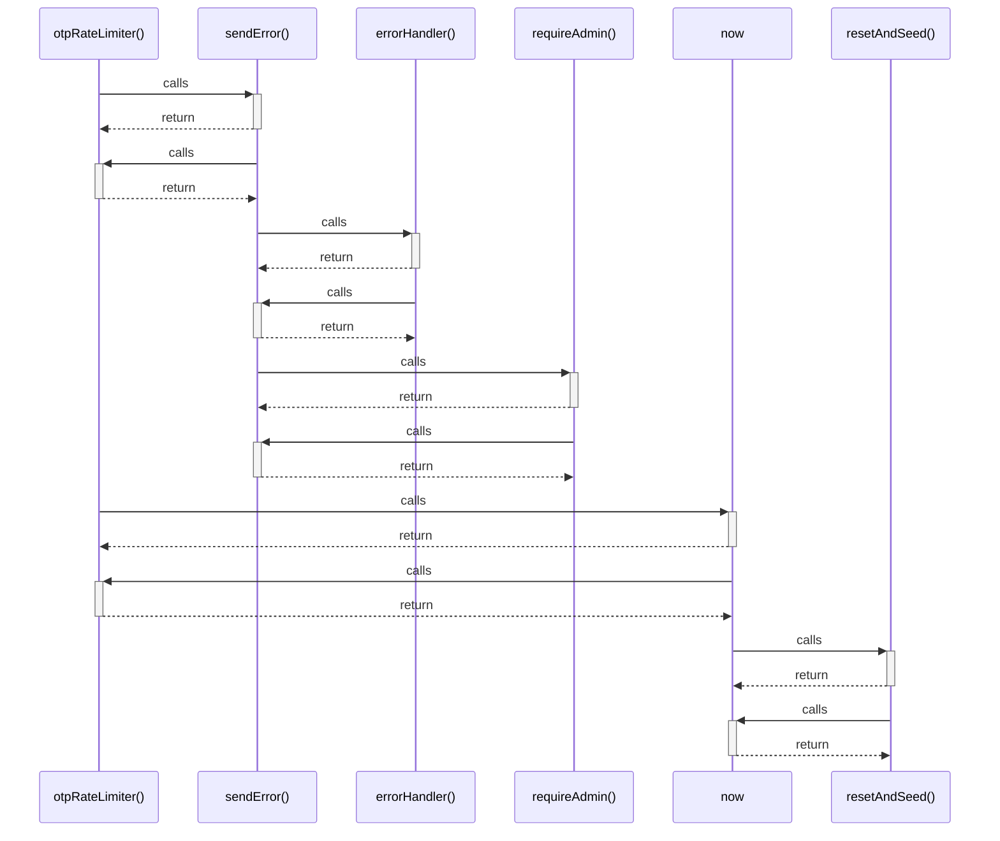

# otpRateLimiter()

> God node · 3 connections · [C:\Users\mohan\Downloads\turf booking app\server\middleware\rateLimiter.js](file:///C:/Users/mohan/Downloads/turf%20booking%20app/server/middleware/rateLimiter.js#L24)

## Call Trace Diagram

## Connections by Relation

### calls
- [[sendError()]] `INFERRED`
- [[now]] `EXTRACTED`

### contains
- [[rateLimiter.js]] `EXTRACTED`

---

*Part of the graphify knowledge wiki. See [[index]] to navigate.*