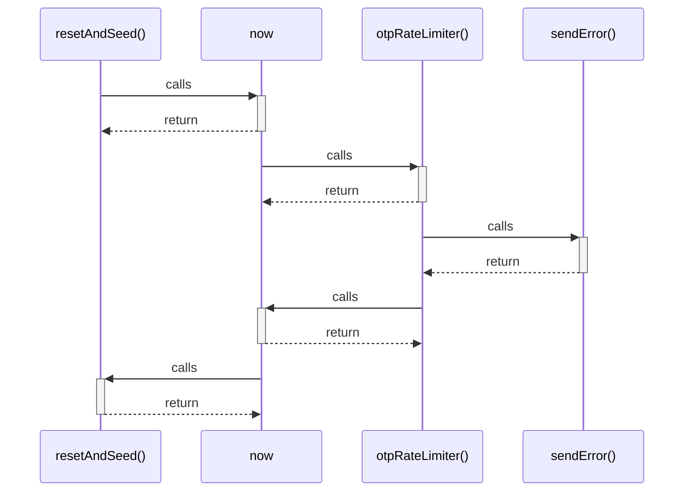

# resetAndSeed()

> God node · 2 connections · [C:\Users\mohan\Downloads\turf booking app\server\scripts\resetDatabase.js](file:///C:/Users/mohan/Downloads/turf%20booking%20app/server/scripts/resetDatabase.js#L11)

## Call Trace Diagram

## Connections by Relation

### calls
- [[now]] `INFERRED`

### contains
- [[resetDatabase.js]] `EXTRACTED`

---

*Part of the graphify knowledge wiki. See [[index]] to navigate.*