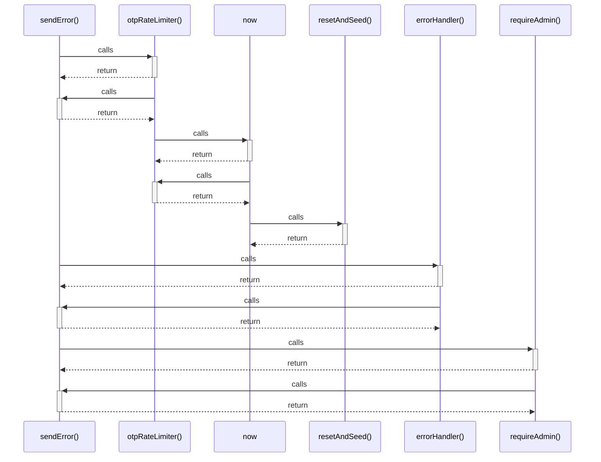

# sendError()

> God node · 4 connections · [C:\Users\mohan\Downloads\turf booking app\server\utils\response.js](file:///C:/Users/mohan/Downloads/turf%20booking%20app/server/utils/response.js#L16)

## Call Trace Diagram

## Connections by Relation

### calls
- [[otpRateLimiter()]] `INFERRED`
- [[errorHandler()]] `INFERRED`
- [[requireAdmin()]] `INFERRED`

### contains
- [[response.js]] `EXTRACTED`

---

*Part of the graphify knowledge wiki. See [[index]] to navigate.*