# BookingCard()

> God node · 6 connections · [C:\Users\mohan\Downloads\turf booking app\TurfVendorApp\src\components\BookingCard.jsx](file:///C:/Users/mohan/Downloads/turf%20booking%20app/TurfVendorApp/src/components/BookingCard.jsx#L24)

## Call Trace Diagram

```mermaid
sequenceDiagram
    participant P0 as BookingCard()
    participant P1 as useTheme()
    participant P2 as TurfCard()
    participant P3 as getImageUrl()
    participant P4 as getStyles()
    participant P5 as BookingDetailScreen()
    participant P6 as fmtDate()
    participant P7 as getStyles()
    participant P8 as CustomAlertModal()
    participant P9 as getAlertMeta()
    participant P10 as getColors()
    participant P11 as PendingRequestCard()
    participant P12 as SlotsScreen()
    participant P13 as TurfApprovedScreen()
    participant P14 as BookingConfirmScreen()
    participant P15 as ProfileScreen()
    participant P16 as SlotPickerScreen()
    participant P17 as TurfDetailScreen()
    participant P18 as SubscriptionDetailScreen()
    participant P19 as TurfProfileScreen()
    participant P20 as TurfSetupScreen()
    participant P21 as SportChip()
    participant P22 as MainTabs()
    participant P23 as CreateMatchScreen()
    participant P24 as LoginScreen()
    participant P25 as PersonalInfoScreen()
    participant P26 as RegisterScreen()
    participant P27 as RequestPendingScreen()
    participant P28 as PlanPromoCard()
    participant P29 as RecentBookingCard()
    participant P30 as StatCard()
    participant P31 as TurfAvatar()
    participant P32 as RootNavigator()
    participant P33 as CheckEmailScreen()
    participant P34 as DashboardScreen()
    participant P35 as EditTurfScreen()
    participant P36 as LandingScreen()
    participant P37 as LocationSearchScreen()
    participant P38 as MyTurfsScreen()
    participant P39 as PersonalInformationScreen()
    participant P40 as TermsScreen()
    participant P41 as TurfUnderReviewScreen()
    participant P42 as TurfVerificationScreen()
    participant P43 as VendorVerificationScreen()
    participant P44 as EmptyState()
    participant P45 as PrimaryButton()
    participant P46 as SearchBar()
    participant P47 as SecondaryButton()
    participant P48 as SectionHeader()
    participant P49 as SkeletonItem()
    participant P50 as TurfCardSkeleton()
    participant P51 as ExploreScreen()
    participant P52 as FilterBottomSheet()
    participant P53 as HomeScreen()
    participant P54 as LocationScreen()
    participant P55 as Login2Screen()
    participant P56 as MyBookingsScreen()
    participant P57 as NoInternetScreen()
    participant P58 as NotificationsScreen()
    participant P59 as OnboardingScreen()
    participant P60 as OTPScreen()
    participant P61 as RateReviewModal()
    participant P62 as WishlistScreen()
    participant P63 as ThemedApp()
    participant P64 as AppText()
    participant P65 as TurfSwitcher()
    participant P66 as CapsuleTabBar()
    participant P67 as AddTurfScreen()
    participant P68 as MySubscriptionScreen()
    participant P69 as NotificationScreen()
    participant P70 as ReportIssuesScreen()
    participant P71 as SubscribeScreen()
    participant P72 as SubscriptionPlansScreen()
    participant P73 as TurfBookingsScreen()
    participant P74 as UserReviewsScreen()
    participant P75 as getStyles()
    participant P76 as shortId()
    participant P77 as formatDate()
    P0->>+ P1: calls
    P1-->>- P0: return
    P1->>+ P0: calls
    P0-->>- P1: return
    P1->>+ P2: calls
    P2-->>- P1: return
    P2->>+ P1: calls
    P1-->>- P2: return
    P2->>+ P3: calls
    P3-->>- P2: return
    P2->>+ P4: calls
    P4-->>- P2: return
    P1->>+ P5: calls
    P5-->>- P1: return
    P5->>+ P1: calls
    P1-->>- P5: return
    P5->>+ P6: calls
    P6-->>- P5: return
    P5->>+ P7: calls
    P7-->>- P5: return
    P1->>+ P8: calls
    P8-->>- P1: return
    P8->>+ P1: calls
    P1-->>- P8: return
    P8->>+ P9: calls
    P9-->>- P8: return
    P8->>+ P10: calls
    P10-->>- P8: return
    P1->>+ P11: calls
    P11-->>- P1: return
    P1->>+ P12: calls
    P12-->>- P1: return
    P1->>+ P13: calls
    P13-->>- P1: return
    P1->>+ P14: calls
    P14-->>- P1: return
    P1->>+ P15: calls
    P15-->>- P1: return
    P1->>+ P16: calls
    P16-->>- P1: return
    P1->>+ P17: calls
    P17-->>- P1: return
    P1->>+ P18: calls
    P18-->>- P1: return
    P1->>+ P19: calls
    P19-->>- P1: return
    P1->>+ P20: calls
    P20-->>- P1: return
    P1->>+ P21: calls
    P21-->>- P1: return
    P1->>+ P22: calls
    P22-->>- P1: return
    P1->>+ P23: calls
    P23-->>- P1: return
    P1->>+ P24: calls
    P24-->>- P1: return
    P1->>+ P25: calls
    P25-->>- P1: return
    P1->>+ P26: calls
    P26-->>- P1: return
    P1->>+ P27: calls
    P27-->>- P1: return
    P1->>+ P28: calls
    P28-->>- P1: return
    P1->>+ P29: calls
    P29-->>- P1: return
    P1->>+ P30: calls
    P30-->>- P1: return
    P1->>+ P31: calls
    P31-->>- P1: return
    P1->>+ P32: calls
    P32-->>- P1: return
    P1->>+ P33: calls
    P33-->>- P1: return
    P1->>+ P34: calls
    P34-->>- P1: return
    P1->>+ P35: calls
    P35-->>- P1: return
    P1->>+ P36: calls
    P36-->>- P1: return
    P1->>+ P37: calls
    P37-->>- P1: return
    P1->>+ P38: calls
    P38-->>- P1: return
    P1->>+ P39: calls
    P39-->>- P1: return
    P1->>+ P40: calls
    P40-->>- P1: return
    P1->>+ P41: calls
    P41-->>- P1: return
    P1->>+ P42: calls
    P42-->>- P1: return
    P1->>+ P43: calls
    P43-->>- P1: return
    P1->>+ P44: calls
    P44-->>- P1: return
    P1->>+ P45: calls
    P45-->>- P1: return
    P1->>+ P46: calls
    P46-->>- P1: return
    P1->>+ P47: calls
    P47-->>- P1: return
    P1->>+ P48: calls
    P48-->>- P1: return
    P1->>+ P49: calls
    P49-->>- P1: return
    P1->>+ P50: calls
    P50-->>- P1: return
    P1->>+ P51: calls
    P51-->>- P1: return
    P1->>+ P52: calls
    P52-->>- P1: return
    P1->>+ P53: calls
    P53-->>- P1: return
    P1->>+ P54: calls
    P54-->>- P1: return
    P1->>+ P55: calls
    P55-->>- P1: return
    P1->>+ P56: calls
    P56-->>- P1: return
    P1->>+ P57: calls
    P57-->>- P1: return
    P1->>+ P58: calls
    P58-->>- P1: return
    P1->>+ P59: calls
    P59-->>- P1: return
    P1->>+ P60: calls
    P60-->>- P1: return
    P1->>+ P61: calls
    P61-->>- P1: return
    P1->>+ P62: calls
    P62-->>- P1: return
    P1->>+ P63: calls
    P63-->>- P1: return
    P1->>+ P64: calls
    P64-->>- P1: return
    P1->>+ P65: calls
    P65-->>- P1: return
    P1->>+ P66: calls
    P66-->>- P1: return
    P1->>+ P67: calls
    P67-->>- P1: return
    P1->>+ P68: calls
    P68-->>- P1: return
    P1->>+ P69: calls
    P69-->>- P1: return
    P1->>+ P70: calls
    P70-->>- P1: return
    P1->>+ P71: calls
    P71-->>- P1: return
    P1->>+ P72: calls
    P72-->>- P1: return
    P1->>+ P73: calls
    P73-->>- P1: return
    P1->>+ P74: calls
    P74-->>- P1: return
    P0->>+ P3: calls
    P3-->>- P0: return
    P0->>+ P75: calls
    P75-->>- P0: return
    P0->>+ P76: calls
    P76-->>- P0: return
    P0->>+ P77: calls
    P77-->>- P0: return
```

## Connections by Relation

### calls
- [[useTheme()]] `INFERRED`
- [[getImageUrl()]] `INFERRED`
- [[getStyles()]] `EXTRACTED`
- [[shortId()]] `EXTRACTED`
- [[formatDate()]] `EXTRACTED`

### contains
- [[BookingCard.jsx]] `EXTRACTED`

---

*Part of the graphify knowledge wiki. See [[index]] to navigate.*