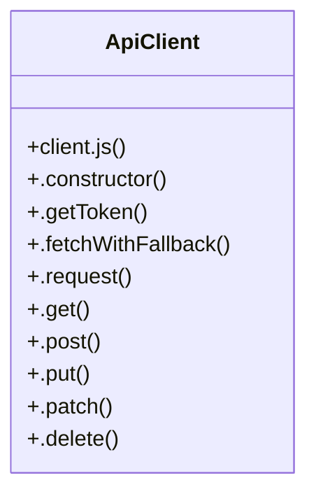

# Candidate Review

> 26 nodes · cohesion 0.10

## Key Concepts

- [client.js](file:///C:/Users/mohan/Downloads/turf%20booking%20app/TurfUserApp/src/api/client.js#L1) (10 connections)
- [ApiClient](file:///C:/Users/mohan/Downloads/turf%20booking%20app/TurfUserApp/src/api/client.js#L30) (10 connections)
- [.request()](file:///C:/Users/mohan/Downloads/turf%20booking%20app/TurfUserApp/src/api/client.js#L77) (8 connections)
- [client.js](file:///C:/Users/mohan/Downloads/turf%20booking%20app/TurfVendorApp/src/api/client.js#L1) (6 connections)
- [RateExperienceModal.jsx](file:///C:/Users/mohan/Downloads/turf%20booking%20app/TurfUserApp/src/screens/RateExperienceModal.jsx#L1) (4 connections)
- [.post()](file:///C:/Users/mohan/Downloads/turf%20booking%20app/TurfUserApp/src/api/client.js#L111) (3 connections)
- [.delete()](file:///C:/Users/mohan/Downloads/turf%20booking%20app/TurfUserApp/src/api/client.js#L114) (2 connections)
- [.fetchWithFallback()](file:///C:/Users/mohan/Downloads/turf%20booking%20app/TurfUserApp/src/api/client.js#L43) (2 connections)
- [.get()](file:///C:/Users/mohan/Downloads/turf%20booking%20app/TurfUserApp/src/api/client.js#L110) (2 connections)
- [.getToken()](file:///C:/Users/mohan/Downloads/turf%20booking%20app/TurfUserApp/src/api/client.js#L35) (2 connections)
- [.patch()](file:///C:/Users/mohan/Downloads/turf%20booking%20app/TurfUserApp/src/api/client.js#L113) (2 connections)
- [.put()](file:///C:/Users/mohan/Downloads/turf%20booking%20app/TurfUserApp/src/api/client.js#L112) (2 connections)
- [BASE_URL](file:///C:/Users/mohan/Downloads/turf%20booking%20app/TurfVendorApp/src/api/client.js#L11) (2 connections)
- [CANDIDATE_URLS](file:///C:/Users/mohan/Downloads/turf%20booking%20app/TurfVendorApp/src/api/client.js#L3) (2 connections)
- [SERVER_ORIGIN](file:///C:/Users/mohan/Downloads/turf%20booking%20app/TurfVendorApp/src/api/client.js#L13) (2 connections)
- [submitReview()](file:///C:/Users/mohan/Downloads/turf%20booking%20app/TurfUserApp/src/screens/RateExperienceModal.jsx#L13) (2 connections)
- [.constructor()](file:///C:/Users/mohan/Downloads/turf%20booking%20app/TurfUserApp/src/api/client.js#L31) (1 connections)
- [client](file:///C:/Users/mohan/Downloads/turf%20booking%20app/TurfUserApp/src/api/client.js#L117) (1 connections)
- [EMULATOR_URL](file:///C:/Users/mohan/Downloads/turf%20booking%20app/TurfUserApp/src/api/client.js#L11) (1 connections)
- [FALLBACK_URL](file:///C:/Users/mohan/Downloads/turf%20booking%20app/TurfVendorApp/src/api/client.js#L12) (1 connections)
- [LAN_URL](file:///C:/Users/mohan/Downloads/turf%20booking%20app/TurfUserApp/src/api/client.js#L10) (1 connections)
- [LOCAL_URL](file:///C:/Users/mohan/Downloads/turf%20booking%20app/TurfUserApp/src/api/client.js#L9) (1 connections)
- [PRODUCTION_URL](file:///C:/Users/mohan/Downloads/turf%20booking%20app/TurfUserApp/src/api/client.js#L8) (1 connections)
- [RateExperienceModal()](file:///C:/Users/mohan/Downloads/turf%20booking%20app/TurfUserApp/src/screens/RateExperienceModal.jsx#L16) (1 connections)
- [STAR_LABELS](file:///C:/Users/mohan/Downloads/turf%20booking%20app/TurfUserApp/src/screens/RateExperienceModal.jsx#L11) (1 connections)
- *... and 1 more nodes in this community*

## Class Diagram

## Relationships

- No strong cross-community connections detected

## Source Files

- [C:\Users\mohan\Downloads\turf booking app\TurfUserApp\src\api\client.js](file:///C:/Users/mohan/Downloads/turf%20booking%20app/TurfUserApp/src/api/client.js)
- [C:\Users\mohan\Downloads\turf booking app\TurfUserApp\src\screens\RateExperienceModal.jsx](file:///C:/Users/mohan/Downloads/turf%20booking%20app/TurfUserApp/src/screens/RateExperienceModal.jsx)
- [C:\Users\mohan\Downloads\turf booking app\TurfVendorApp\src\api\client.js](file:///C:/Users/mohan/Downloads/turf%20booking%20app/TurfVendorApp/src/api/client.js)

## Audit Trail

- EXTRACTED: 69 (97%)
- INFERRED: 2 (3%)
- AMBIGUOUS: 0 (0%)

---

*Part of the graphify knowledge wiki. See [[index]] to navigate.*