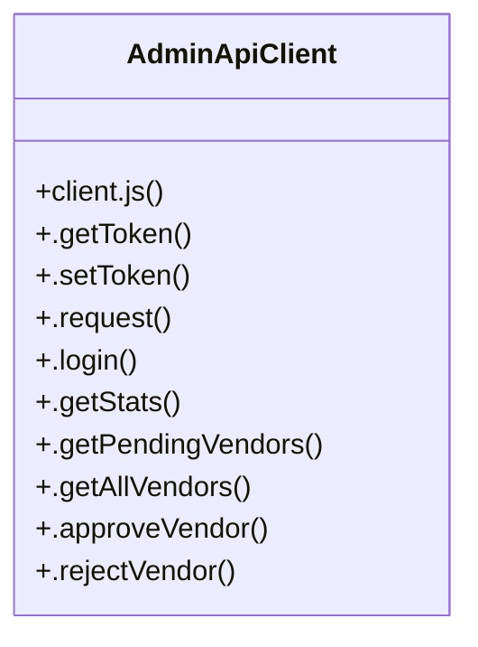

# Community 4

> 28 nodes · cohesion 0.13

## Key Concepts

- [AdminApiClient](file:///C:/Users/mohan/Downloads/turf%20booking%20app/superadmin-panel/src/api/client.js#L8) (24 connections)
- [.request()](file:///C:/Users/mohan/Downloads/turf%20booking%20app/superadmin-panel/src/api/client.js#L21) (23 connections)
- [client.js](file:///C:/Users/mohan/Downloads/turf%20booking%20app/superadmin-panel/src/api/client.js#L1) (4 connections)
- [.approveVendor()](file:///C:/Users/mohan/Downloads/turf%20booking%20app/superadmin-panel/src/api/client.js#L85) (2 connections)
- [.createSubscriptionPlan()](file:///C:/Users/mohan/Downloads/turf%20booking%20app/superadmin-panel/src/api/client.js#L162) (2 connections)
- [.deleteSubscriptionPlan()](file:///C:/Users/mohan/Downloads/turf%20booking%20app/superadmin-panel/src/api/client.js#L176) (2 connections)
- [.deleteUser()](file:///C:/Users/mohan/Downloads/turf%20booking%20app/superadmin-panel/src/api/client.js#L128) (2 connections)
- [.getAllBookings()](file:///C:/Users/mohan/Downloads/turf%20booking%20app/superadmin-panel/src/api/client.js#L108) (2 connections)
- [.getAllMatches()](file:///C:/Users/mohan/Downloads/turf%20booking%20app/superadmin-panel/src/api/client.js#L134) (2 connections)
- [.getAllReports()](file:///C:/Users/mohan/Downloads/turf%20booking%20app/superadmin-panel/src/api/client.js#L142) (2 connections)
- [.getAllReviews()](file:///C:/Users/mohan/Downloads/turf%20booking%20app/superadmin-panel/src/api/client.js#L182) (2 connections)
- [.getAllTurfs()](file:///C:/Users/mohan/Downloads/turf%20booking%20app/superadmin-panel/src/api/client.js#L96) (2 connections)
- [.getAllUsers()](file:///C:/Users/mohan/Downloads/turf%20booking%20app/superadmin-panel/src/api/client.js#L117) (2 connections)
- [.getAllVendors()](file:///C:/Users/mohan/Downloads/turf%20booking%20app/superadmin-panel/src/api/client.js#L77) (2 connections)
- [.getPendingVendors()](file:///C:/Users/mohan/Downloads/turf%20booking%20app/superadmin-panel/src/api/client.js#L73) (2 connections)
- [.getStats()](file:///C:/Users/mohan/Downloads/turf%20booking%20app/superadmin-panel/src/api/client.js#L69) (2 connections)
- [.getSubscriptionPlans()](file:///C:/Users/mohan/Downloads/turf%20booking%20app/superadmin-panel/src/api/client.js#L158) (2 connections)
- [.getToken()](file:///C:/Users/mohan/Downloads/turf%20booking%20app/superadmin-panel/src/api/client.js#L9) (2 connections)
- [.login()](file:///C:/Users/mohan/Downloads/turf%20booking%20app/superadmin-panel/src/api/client.js#L62) (2 connections)
- [.rejectVendor()](file:///C:/Users/mohan/Downloads/turf%20booking%20app/superadmin-panel/src/api/client.js#L89) (2 connections)
- [.resolveReport()](file:///C:/Users/mohan/Downloads/turf%20booking%20app/superadmin-panel/src/api/client.js#L150) (2 connections)
- [.setToken()](file:///C:/Users/mohan/Downloads/turf%20booking%20app/superadmin-panel/src/api/client.js#L13) (2 connections)
- [.toggleTurfStatus()](file:///C:/Users/mohan/Downloads/turf%20booking%20app/superadmin-panel/src/api/client.js#L104) (2 connections)
- [.updateSubscriptionPlan()](file:///C:/Users/mohan/Downloads/turf%20booking%20app/superadmin-panel/src/api/client.js#L169) (2 connections)
- [.updateUser()](file:///C:/Users/mohan/Downloads/turf%20booking%20app/superadmin-panel/src/api/client.js#L121) (2 connections)
- *... and 3 more nodes in this community*

## Class Diagram

## Relationships

- No strong cross-community connections detected

## Source Files

- [C:\Users\mohan\Downloads\turf booking app\superadmin-panel\src\api\client.js](file:///C:/Users/mohan/Downloads/turf%20booking%20app/superadmin-panel/src/api/client.js)

## Audit Trail

- EXTRACTED: 98 (100%)
- INFERRED: 0 (0%)
- AMBIGUOUS: 0 (0%)

---

*Part of the graphify knowledge wiki. See [[index]] to navigate.*