# CustomAlertModal()

> God node · 5 connections · [C:\Users\mohan\Downloads\turf booking app\TurfVendorApp\src\components\CustomAlertModal.jsx](file:///C:/Users/mohan/Downloads/turf%20booking%20app/TurfVendorApp/src/components/CustomAlertModal.jsx#L58)

## Call Trace Diagram

```mermaid
sequenceDiagram
    participant P0 as CustomAlertModal()
    participant P1 as useTheme()
    participant P2 as BookingCard()
    participant P3 as getImageUrl()
    participant P4 as getStyles()
    participant P5 as shortId()
    participant P6 as formatDate()
    participant P7 as TurfCard()
    participant P8 as getStyles()
    participant P9 as BookingDetailScreen()
    participant P10 as fmtDate()
    participant P11 as getStyles()
    participant P12 as PendingRequestCard()
    participant P13 as SlotsScreen()
    participant P14 as TurfApprovedScreen()
    participant P15 as BookingConfirmScreen()
    participant P16 as ProfileScreen()
    participant P17 as SlotPickerScreen()
    participant P18 as TurfDetailScreen()
    participant P19 as SubscriptionDetailScreen()
    participant P20 as TurfProfileScreen()
    participant P21 as TurfSetupScreen()
    participant P22 as SportChip()
    participant P23 as MainTabs()
    participant P24 as CreateMatchScreen()
    participant P25 as LoginScreen()
    participant P26 as PersonalInfoScreen()
    participant P27 as RegisterScreen()
    participant P28 as RequestPendingScreen()
    participant P29 as PlanPromoCard()
    participant P30 as RecentBookingCard()
    participant P31 as StatCard()
    participant P32 as TurfAvatar()
    participant P33 as RootNavigator()
    participant P34 as CheckEmailScreen()
    participant P35 as DashboardScreen()
    participant P36 as EditTurfScreen()
    participant P37 as LandingScreen()
    participant P38 as LocationSearchScreen()
    participant P39 as MyTurfsScreen()
    participant P40 as PersonalInformationScreen()
    participant P41 as TermsScreen()
    participant P42 as TurfUnderReviewScreen()
    participant P43 as TurfVerificationScreen()
    participant P44 as VendorVerificationScreen()
    participant P45 as EmptyState()
    participant P46 as PrimaryButton()
    participant P47 as SearchBar()
    participant P48 as SecondaryButton()
    participant P49 as SectionHeader()
    participant P50 as SkeletonItem()
    participant P51 as TurfCardSkeleton()
    participant P52 as ExploreScreen()
    participant P53 as FilterBottomSheet()
    participant P54 as HomeScreen()
    participant P55 as LocationScreen()
    participant P56 as Login2Screen()
    participant P57 as MyBookingsScreen()
    participant P58 as NoInternetScreen()
    participant P59 as NotificationsScreen()
    participant P60 as OnboardingScreen()
    participant P61 as OTPScreen()
    participant P62 as RateReviewModal()
    participant P63 as WishlistScreen()
    participant P64 as ThemedApp()
    participant P65 as AppText()
    participant P66 as TurfSwitcher()
    participant P67 as CapsuleTabBar()
    participant P68 as AddTurfScreen()
    participant P69 as MySubscriptionScreen()
    participant P70 as NotificationScreen()
    participant P71 as ReportIssuesScreen()
    participant P72 as SubscribeScreen()
    participant P73 as SubscriptionPlansScreen()
    participant P74 as TurfBookingsScreen()
    participant P75 as UserReviewsScreen()
    participant P76 as getAlertMeta()
    participant P77 as getColors()
    P0->>+ P1: calls
    P1-->>- P0: return
    P1->>+ P2: calls
    P2-->>- P1: return
    P2->>+ P1: calls
    P1-->>- P2: return
    P2->>+ P3: calls
    P3-->>- P2: return
    P2->>+ P4: calls
    P4-->>- P2: return
    P2->>+ P5: calls
    P5-->>- P2: return
    P2->>+ P6: calls
    P6-->>- P2: return
    P1->>+ P7: calls
    P7-->>- P1: return
    P7->>+ P1: calls
    P1-->>- P7: return
    P7->>+ P3: calls
    P3-->>- P7: return
    P7->>+ P8: calls
    P8-->>- P7: return
    P1->>+ P9: calls
    P9-->>- P1: return
    P9->>+ P1: calls
    P1-->>- P9: return
    P9->>+ P10: calls
    P10-->>- P9: return
    P9->>+ P11: calls
    P11-->>- P9: return
    P1->>+ P0: calls
    P0-->>- P1: return
    P1->>+ P12: calls
    P12-->>- P1: return
    P1->>+ P13: calls
    P13-->>- P1: return
    P1->>+ P14: calls
    P14-->>- P1: return
    P1->>+ P15: calls
    P15-->>- P1: return
    P1->>+ P16: calls
    P16-->>- P1: return
    P1->>+ P17: calls
    P17-->>- P1: return
    P1->>+ P18: calls
    P18-->>- P1: return
    P1->>+ P19: calls
    P19-->>- P1: return
    P1->>+ P20: calls
    P20-->>- P1: return
    P1->>+ P21: calls
    P21-->>- P1: return
    P1->>+ P22: calls
    P22-->>- P1: return
    P1->>+ P23: calls
    P23-->>- P1: return
    P1->>+ P24: calls
    P24-->>- P1: return
    P1->>+ P25: calls
    P25-->>- P1: return
    P1->>+ P26: calls
    P26-->>- P1: return
    P1->>+ P27: calls
    P27-->>- P1: return
    P1->>+ P28: calls
    P28-->>- P1: return
    P1->>+ P29: calls
    P29-->>- P1: return
    P1->>+ P30: calls
    P30-->>- P1: return
    P1->>+ P31: calls
    P31-->>- P1: return
    P1->>+ P32: calls
    P32-->>- P1: return
    P1->>+ P33: calls
    P33-->>- P1: return
    P1->>+ P34: calls
    P34-->>- P1: return
    P1->>+ P35: calls
    P35-->>- P1: return
    P1->>+ P36: calls
    P36-->>- P1: return
    P1->>+ P37: calls
    P37-->>- P1: return
    P1->>+ P38: calls
    P38-->>- P1: return
    P1->>+ P39: calls
    P39-->>- P1: return
    P1->>+ P40: calls
    P40-->>- P1: return
    P1->>+ P41: calls
    P41-->>- P1: return
    P1->>+ P42: calls
    P42-->>- P1: return
    P1->>+ P43: calls
    P43-->>- P1: return
    P1->>+ P44: calls
    P44-->>- P1: return
    P1->>+ P45: calls
    P45-->>- P1: return
    P1->>+ P46: calls
    P46-->>- P1: return
    P1->>+ P47: calls
    P47-->>- P1: return
    P1->>+ P48: calls
    P48-->>- P1: return
    P1->>+ P49: calls
    P49-->>- P1: return
    P1->>+ P50: calls
    P50-->>- P1: return
    P1->>+ P51: calls
    P51-->>- P1: return
    P1->>+ P52: calls
    P52-->>- P1: return
    P1->>+ P53: calls
    P53-->>- P1: return
    P1->>+ P54: calls
    P54-->>- P1: return
    P1->>+ P55: calls
    P55-->>- P1: return
    P1->>+ P56: calls
    P56-->>- P1: return
    P1->>+ P57: calls
    P57-->>- P1: return
    P1->>+ P58: calls
    P58-->>- P1: return
    P1->>+ P59: calls
    P59-->>- P1: return
    P1->>+ P60: calls
    P60-->>- P1: return
    P1->>+ P61: calls
    P61-->>- P1: return
    P1->>+ P62: calls
    P62-->>- P1: return
    P1->>+ P63: calls
    P63-->>- P1: return
    P1->>+ P64: calls
    P64-->>- P1: return
    P1->>+ P65: calls
    P65-->>- P1: return
    P1->>+ P66: calls
    P66-->>- P1: return
    P1->>+ P67: calls
    P67-->>- P1: return
    P1->>+ P68: calls
    P68-->>- P1: return
    P1->>+ P69: calls
    P69-->>- P1: return
    P1->>+ P70: calls
    P70-->>- P1: return
    P1->>+ P71: calls
    P71-->>- P1: return
    P1->>+ P72: calls
    P72-->>- P1: return
    P1->>+ P73: calls
    P73-->>- P1: return
    P1->>+ P74: calls
    P74-->>- P1: return
    P1->>+ P75: calls
    P75-->>- P1: return
    P0->>+ P76: calls
    P76-->>- P0: return
    P0->>+ P77: calls
    P77-->>- P0: return
```

## Connections by Relation

### calls
- [[useTheme()]] `INFERRED`
- [[getAlertMeta()]] `EXTRACTED`
- [[getColors()]] `INFERRED`

### contains
- [[CustomAlertModal.jsx]] `EXTRACTED`
- [[CustomAlertModal.jsx]] `EXTRACTED`

---

*Part of the graphify knowledge wiki. See [[index]] to navigate.*