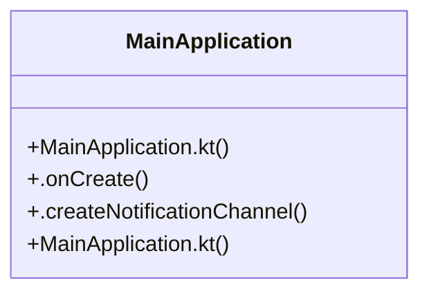

# React Native Setup

> 8 nodes · cohesion 0.36

## Key Concepts

- [MainApplication.kt](file:///C:/Users/mohan/Downloads/turf%20booking%20app/TurfUserApp/android/app/src/main/java/com/turfuserapp/MainApplication.kt#L1) (4 connections)
- [MainApplication.kt](file:///C:/Users/mohan/Downloads/turf%20booking%20app/TurfVendorApp/android/app/src/main/java/com/turfvendorapp/MainApplication.kt#L1) (4 connections)
- [MainApplication](file:///C:/Users/mohan/Downloads/turf%20booking%20app/TurfVendorApp/android/app/src/main/java/com/turfvendorapp/MainApplication.kt#L14) (4 connections)
- [getJSMainModuleName()](file:///C:/Users/mohan/Downloads/turf%20booking%20app/TurfVendorApp/android/app/src/main/java/com/turfvendorapp/MainApplication.kt#L24) (2 connections)
- [getPackages()](file:///C:/Users/mohan/Downloads/turf%20booking%20app/TurfVendorApp/android/app/src/main/java/com/turfvendorapp/MainApplication.kt#L18) (2 connections)
- [getUseDeveloperSupport()](file:///C:/Users/mohan/Downloads/turf%20booking%20app/TurfVendorApp/android/app/src/main/java/com/turfvendorapp/MainApplication.kt#L26) (2 connections)
- [.createNotificationChannel()](file:///C:/Users/mohan/Downloads/turf%20booking%20app/TurfVendorApp/android/app/src/main/java/com/turfvendorapp/MainApplication.kt#L45) (1 connections)
- [.onCreate()](file:///C:/Users/mohan/Downloads/turf%20booking%20app/TurfVendorApp/android/app/src/main/java/com/turfvendorapp/MainApplication.kt#L35) (1 connections)

## Class Diagram

## Relationships

- No strong cross-community connections detected

## Source Files

- [C:\Users\mohan\Downloads\turf booking app\TurfUserApp\android\app\src\main\java\com\turfuserapp\MainApplication.kt](file:///C:/Users/mohan/Downloads/turf%20booking%20app/TurfUserApp/android/app/src/main/java/com/turfuserapp/MainApplication.kt)
- [C:\Users\mohan\Downloads\turf booking app\TurfVendorApp\android\app\src\main\java\com\turfvendorapp\MainApplication.kt](file:///C:/Users/mohan/Downloads/turf%20booking%20app/TurfVendorApp/android/app/src/main/java/com/turfvendorapp/MainApplication.kt)

## Audit Trail

- EXTRACTED: 20 (100%)
- INFERRED: 0 (0%)
- AMBIGUOUS: 0 (0%)

---

*Part of the graphify knowledge wiki. See [[index]] to navigate.*