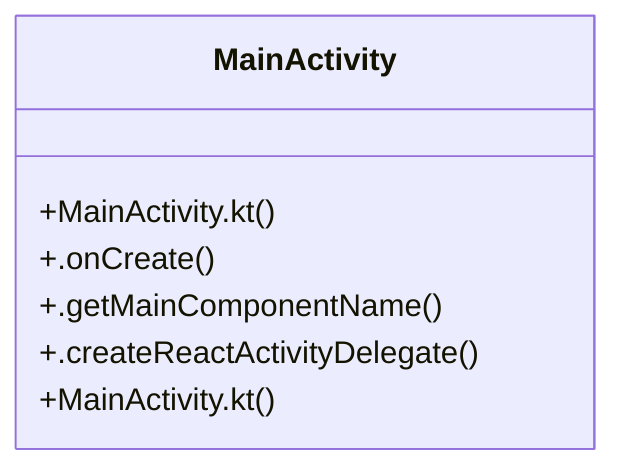

# User Interface

> 6 nodes · cohesion 0.33

## Key Concepts

- [MainActivity](file:///C:/Users/mohan/Downloads/turf%20booking%20app/TurfVendorApp/android/app/src/main/java/com/turfvendorapp/MainActivity.kt#L8) (5 connections)
- [MainActivity.kt](file:///C:/Users/mohan/Downloads/turf%20booking%20app/TurfUserApp/android/app/src/main/java/com/turfuserapp/MainActivity.kt#L1) (1 connections)
- [MainActivity.kt](file:///C:/Users/mohan/Downloads/turf%20booking%20app/TurfVendorApp/android/app/src/main/java/com/turfvendorapp/MainActivity.kt#L1) (1 connections)
- [.createReactActivityDelegate()](file:///C:/Users/mohan/Downloads/turf%20booking%20app/TurfVendorApp/android/app/src/main/java/com/turfvendorapp/MainActivity.kt#L24) (1 connections)
- [.getMainComponentName()](file:///C:/Users/mohan/Downloads/turf%20booking%20app/TurfVendorApp/android/app/src/main/java/com/turfvendorapp/MainActivity.kt#L18) (1 connections)
- [.onCreate()](file:///C:/Users/mohan/Downloads/turf%20booking%20app/TurfVendorApp/android/app/src/main/java/com/turfvendorapp/MainActivity.kt#L10) (1 connections)

## Class Diagram

## Relationships

- No strong cross-community connections detected

## Source Files

- [C:\Users\mohan\Downloads\turf booking app\TurfUserApp\android\app\src\main\java\com\turfuserapp\MainActivity.kt](file:///C:/Users/mohan/Downloads/turf%20booking%20app/TurfUserApp/android/app/src/main/java/com/turfuserapp/MainActivity.kt)
- [C:\Users\mohan\Downloads\turf booking app\TurfVendorApp\android\app\src\main\java\com\turfvendorapp\MainActivity.kt](file:///C:/Users/mohan/Downloads/turf%20booking%20app/TurfVendorApp/android/app/src/main/java/com/turfvendorapp/MainActivity.kt)

## Audit Trail

- EXTRACTED: 10 (100%)
- INFERRED: 0 (0%)
- AMBIGUOUS: 0 (0%)

---

*Part of the graphify knowledge wiki. See [[index]] to navigate.*