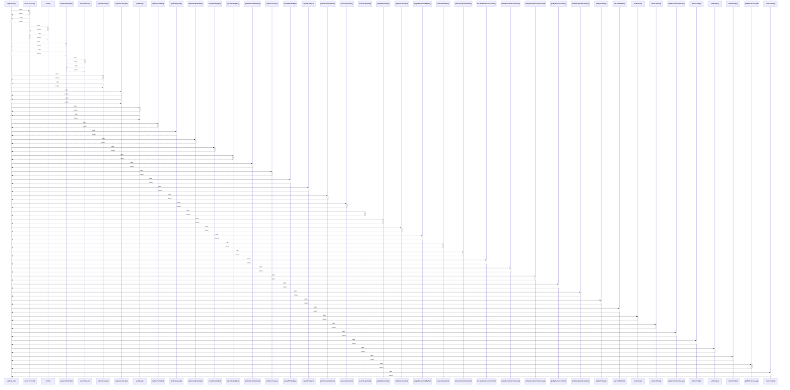

# apiRequest()

> God node · 38 connections · [C:\Users\mohan\Downloads\turf booking app\TurfVendorApp\src\api\client.js](file:///C:/Users/mohan/Downloads/turf%20booking%20app/TurfVendorApp/src/api/client.js#L21)

## Call Trace Diagram

## Connections by Relation

### calls
- [[createTurfDraft()]] `INFERRED`
- [[updateTurfInfoApi()]] `INFERRED`
- [[loginVendorApi()]] `INFERRED`
- [[registerVendorApi()]] `INFERRED`
- [[getMeApi()]] `INFERRED`
- [[updateProfileApi()]] `INFERRED`
- [[getBookingsApi()]] `INFERRED`
- [[getBookingDetailApi()]] `INFERRED`
- [[acceptBookingApi()]] `INFERRED`
- [[rejectBookingApi()]] `INFERRED`
- [[getDashboardStatsApi()]] `INFERRED`
- [[getRevenueApi()]] `INFERRED`
- [[uploadVendorKyc()]] `INFERRED`
- [[uploadTurfKyc()]] `INFERRED`
- [[getOnboardingStatus()]] `INFERRED`
- [[getIssueTypesApi()]] `INFERRED`
- [[submitReportApi()]] `INFERRED`
- [[getMyReportsApi()]] `INFERRED`
- [[getMyReviewsApi()]] `INFERRED`
- [[toggleReviewVisibilityApi()]] `INFERRED`

### contains
- [[client.js]] `EXTRACTED`

---

*Part of the graphify knowledge wiki. See [[index]] to navigate.*