# getImageUrl()

> God node · 10 connections · [C:\Users\mohan\Downloads\turf booking app\TurfVendorApp\src\api\client.js](file:///C:/Users/mohan/Downloads/turf%20booking%20app/TurfVendorApp/src/api/client.js#L15)

## Call Trace Diagram

```mermaid
sequenceDiagram
    participant P0 as getImageUrl()
    participant P1 as BookingCard()
    participant P2 as useTheme()
    participant P3 as TurfCard()
    participant P4 as BookingDetailScreen()
    participant P5 as CustomAlertModal()
    participant P6 as PendingRequestCard()
    participant P7 as SlotsScreen()
    participant P8 as TurfApprovedScreen()
    participant P9 as BookingConfirmScreen()
    participant P10 as ProfileScreen()
    participant P11 as SlotPickerScreen()
    participant P12 as TurfDetailScreen()
    participant P13 as SubscriptionDetailScreen()
    participant P14 as TurfProfileScreen()
    participant P15 as TurfSetupScreen()
    participant P16 as SportChip()
    participant P17 as MainTabs()
    participant P18 as CreateMatchScreen()
    participant P19 as LoginScreen()
    participant P20 as PersonalInfoScreen()
    participant P21 as RegisterScreen()
    participant P22 as RequestPendingScreen()
    participant P23 as PlanPromoCard()
    participant P24 as RecentBookingCard()
    participant P25 as StatCard()
    participant P26 as TurfAvatar()
    participant P27 as RootNavigator()
    participant P28 as CheckEmailScreen()
    participant P29 as DashboardScreen()
    participant P30 as EditTurfScreen()
    participant P31 as LandingScreen()
    participant P32 as LocationSearchScreen()
    participant P33 as MyTurfsScreen()
    participant P34 as PersonalInformationScreen()
    participant P35 as TermsScreen()
    participant P36 as TurfUnderReviewScreen()
    participant P37 as TurfVerificationScreen()
    participant P38 as VendorVerificationScreen()
    participant P39 as EmptyState()
    participant P40 as PrimaryButton()
    participant P41 as SearchBar()
    participant P42 as SecondaryButton()
    participant P43 as SectionHeader()
    participant P44 as SkeletonItem()
    participant P45 as TurfCardSkeleton()
    participant P46 as ExploreScreen()
    participant P47 as FilterBottomSheet()
    participant P48 as HomeScreen()
    participant P49 as LocationScreen()
    participant P50 as Login2Screen()
    participant P51 as MyBookingsScreen()
    participant P52 as NoInternetScreen()
    participant P53 as NotificationsScreen()
    participant P54 as OnboardingScreen()
    participant P55 as OTPScreen()
    participant P56 as RateReviewModal()
    participant P57 as WishlistScreen()
    participant P58 as ThemedApp()
    participant P59 as AppText()
    participant P60 as TurfSwitcher()
    participant P61 as CapsuleTabBar()
    participant P62 as AddTurfScreen()
    participant P63 as MySubscriptionScreen()
    participant P64 as NotificationScreen()
    participant P65 as ReportIssuesScreen()
    participant P66 as SubscribeScreen()
    participant P67 as SubscriptionPlansScreen()
    participant P68 as TurfBookingsScreen()
    participant P69 as UserReviewsScreen()
    participant P70 as getStyles()
    participant P71 as shortId()
    participant P72 as formatDate()
    P0->>+ P1: calls
    P1-->>- P0: return
    P1->>+ P2: calls
    P2-->>- P1: return
    P2->>+ P1: calls
    P1-->>- P2: return
    P2->>+ P3: calls
    P3-->>- P2: return
    P2->>+ P4: calls
    P4-->>- P2: return
    P2->>+ P5: calls
    P5-->>- P2: return
    P2->>+ P6: calls
    P6-->>- P2: return
    P2->>+ P7: calls
    P7-->>- P2: return
    P2->>+ P8: calls
    P8-->>- P2: return
    P2->>+ P9: calls
    P9-->>- P2: return
    P2->>+ P10: calls
    P10-->>- P2: return
    P2->>+ P11: calls
    P11-->>- P2: return
    P2->>+ P12: calls
    P12-->>- P2: return
    P2->>+ P13: calls
    P13-->>- P2: return
    P2->>+ P14: calls
    P14-->>- P2: return
    P2->>+ P15: calls
    P15-->>- P2: return
    P2->>+ P16: calls
    P16-->>- P2: return
    P2->>+ P17: calls
    P17-->>- P2: return
    P2->>+ P18: calls
    P18-->>- P2: return
    P2->>+ P19: calls
    P19-->>- P2: return
    P2->>+ P20: calls
    P20-->>- P2: return
    P2->>+ P21: calls
    P21-->>- P2: return
    P2->>+ P22: calls
    P22-->>- P2: return
    P2->>+ P23: calls
    P23-->>- P2: return
    P2->>+ P24: calls
    P24-->>- P2: return
    P2->>+ P25: calls
    P25-->>- P2: return
    P2->>+ P26: calls
    P26-->>- P2: return
    P2->>+ P27: calls
    P27-->>- P2: return
    P2->>+ P28: calls
    P28-->>- P2: return
    P2->>+ P29: calls
    P29-->>- P2: return
    P2->>+ P30: calls
    P30-->>- P2: return
    P2->>+ P31: calls
    P31-->>- P2: return
    P2->>+ P32: calls
    P32-->>- P2: return
    P2->>+ P33: calls
    P33-->>- P2: return
    P2->>+ P34: calls
    P34-->>- P2: return
    P2->>+ P35: calls
    P35-->>- P2: return
    P2->>+ P36: calls
    P36-->>- P2: return
    P2->>+ P37: calls
    P37-->>- P2: return
    P2->>+ P38: calls
    P38-->>- P2: return
    P2->>+ P39: calls
    P39-->>- P2: return
    P2->>+ P40: calls
    P40-->>- P2: return
    P2->>+ P41: calls
    P41-->>- P2: return
    P2->>+ P42: calls
    P42-->>- P2: return
    P2->>+ P43: calls
    P43-->>- P2: return
    P2->>+ P44: calls
    P44-->>- P2: return
    P2->>+ P45: calls
    P45-->>- P2: return
    P2->>+ P46: calls
    P46-->>- P2: return
    P2->>+ P47: calls
    P47-->>- P2: return
    P2->>+ P48: calls
    P48-->>- P2: return
    P2->>+ P49: calls
    P49-->>- P2: return
    P2->>+ P50: calls
    P50-->>- P2: return
    P2->>+ P51: calls
    P51-->>- P2: return
    P2->>+ P52: calls
    P52-->>- P2: return
    P2->>+ P53: calls
    P53-->>- P2: return
    P2->>+ P54: calls
    P54-->>- P2: return
    P2->>+ P55: calls
    P55-->>- P2: return
    P2->>+ P56: calls
    P56-->>- P2: return
    P2->>+ P57: calls
    P57-->>- P2: return
    P2->>+ P58: calls
    P58-->>- P2: return
    P2->>+ P59: calls
    P59-->>- P2: return
    P2->>+ P60: calls
    P60-->>- P2: return
    P2->>+ P61: calls
    P61-->>- P2: return
    P2->>+ P62: calls
    P62-->>- P2: return
    P2->>+ P63: calls
    P63-->>- P2: return
    P2->>+ P64: calls
    P64-->>- P2: return
    P2->>+ P65: calls
    P65-->>- P2: return
    P2->>+ P66: calls
    P66-->>- P2: return
    P2->>+ P67: calls
    P67-->>- P2: return
    P2->>+ P68: calls
    P68-->>- P2: return
    P2->>+ P69: calls
    P69-->>- P2: return
    P1->>+ P0: calls
    P0-->>- P1: return
    P1->>+ P70: calls
    P70-->>- P1: return
    P1->>+ P71: calls
    P71-->>- P1: return
    P1->>+ P72: calls
    P72-->>- P1: return
    P0->>+ P3: calls
    P3-->>- P0: return
    P0->>+ P9: calls
    P9-->>- P0: return
    P0->>+ P10: calls
    P10-->>- P0: return
    P0->>+ P14: calls
    P14-->>- P0: return
    P0->>+ P20: calls
    P20-->>- P0: return
    P0->>+ P26: calls
    P26-->>- P0: return
    P0->>+ P34: calls
    P34-->>- P0: return
```

## Connections by Relation

### calls
- [[BookingCard()]] `INFERRED`
- [[TurfCard()]] `INFERRED`
- [[BookingConfirmScreen()]] `INFERRED`
- [[ProfileScreen()]] `INFERRED`
- [[TurfProfileScreen()]] `INFERRED`
- [[PersonalInfoScreen()]] `INFERRED`
- [[TurfAvatar()]] `INFERRED`
- [[PersonalInformationScreen()]] `INFERRED`

### contains
- [[client.js]] `EXTRACTED`
- [[client.js]] `EXTRACTED`

---

*Part of the graphify knowledge wiki. See [[index]] to navigate.*