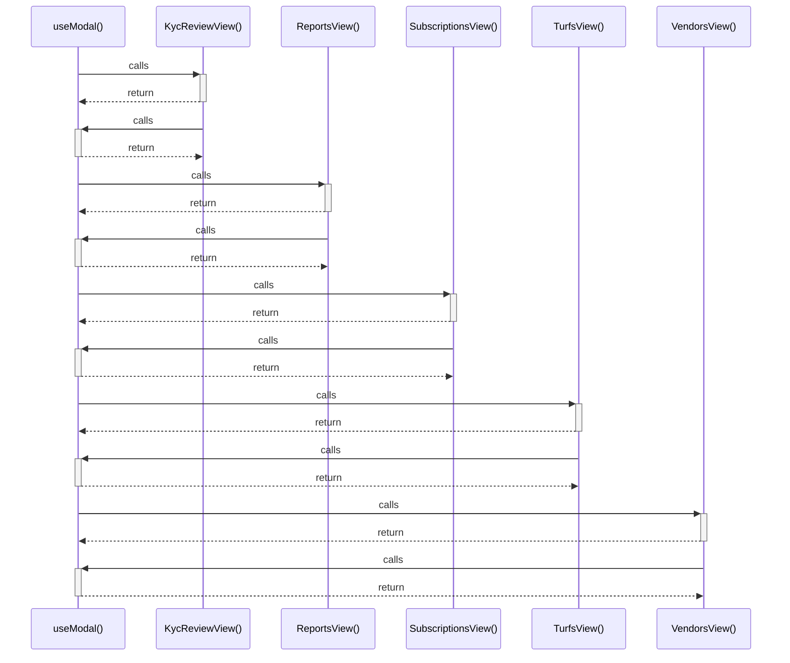

# useModal()

> God node · 6 connections · [C:\Users\mohan\Downloads\turf booking app\superadmin-panel\src\context\ModalContext.jsx](file:///C:/Users/mohan/Downloads/turf%20booking%20app/superadmin-panel/src/context/ModalContext.jsx#L193)

## Call Trace Diagram

## Connections by Relation

### calls
- [[KycReviewView()]] `INFERRED`
- [[ReportsView()]] `INFERRED`
- [[SubscriptionsView()]] `INFERRED`
- [[TurfsView()]] `INFERRED`
- [[VendorsView()]] `INFERRED`

### contains
- [[ModalContext.jsx]] `EXTRACTED`

---

*Part of the graphify knowledge wiki. See [[index]] to navigate.*