# useTheme()

> God node · 69 connections · [C:\Users\mohan\Downloads\turf booking app\TurfVendorApp\src\context\ThemeContext.jsx](file:///C:/Users/mohan/Downloads/turf%20booking%20app/TurfVendorApp/src/context/ThemeContext.jsx#L60)

## Call Trace Diagram

```mermaid
sequenceDiagram
    participant P0 as useTheme()
    participant P1 as BookingCard()
    participant P2 as getImageUrl()
    participant P3 as TurfCard()
    participant P4 as BookingConfirmScreen()
    participant P5 as ProfileScreen()
    participant P6 as TurfProfileScreen()
    participant P7 as PersonalInfoScreen()
    participant P8 as TurfAvatar()
    participant P9 as PersonalInformationScreen()
    participant P10 as getStyles()
    participant P11 as shortId()
    participant P12 as formatDate()
    participant P13 as BookingDetailScreen()
    participant P14 as CustomAlertModal()
    participant P15 as PendingRequestCard()
    participant P16 as SlotsScreen()
    participant P17 as TurfApprovedScreen()
    participant P18 as SlotPickerScreen()
    participant P19 as TurfDetailScreen()
    participant P20 as SubscriptionDetailScreen()
    participant P21 as TurfSetupScreen()
    participant P22 as SportChip()
    participant P23 as MainTabs()
    participant P24 as CreateMatchScreen()
    participant P25 as LoginScreen()
    participant P26 as RegisterScreen()
    participant P27 as RequestPendingScreen()
    participant P28 as PlanPromoCard()
    participant P29 as RecentBookingCard()
    participant P30 as StatCard()
    participant P31 as RootNavigator()
    participant P32 as CheckEmailScreen()
    participant P33 as DashboardScreen()
    participant P34 as EditTurfScreen()
    participant P35 as LandingScreen()
    participant P36 as LocationSearchScreen()
    participant P37 as MyTurfsScreen()
    participant P38 as TermsScreen()
    participant P39 as TurfUnderReviewScreen()
    participant P40 as TurfVerificationScreen()
    participant P41 as VendorVerificationScreen()
    participant P42 as EmptyState()
    participant P43 as PrimaryButton()
    participant P44 as SearchBar()
    participant P45 as SecondaryButton()
    participant P46 as SectionHeader()
    participant P47 as SkeletonItem()
    participant P48 as TurfCardSkeleton()
    participant P49 as ExploreScreen()
    participant P50 as FilterBottomSheet()
    participant P51 as HomeScreen()
    participant P52 as LocationScreen()
    participant P53 as Login2Screen()
    participant P54 as MyBookingsScreen()
    participant P55 as NoInternetScreen()
    participant P56 as NotificationsScreen()
    participant P57 as OnboardingScreen()
    participant P58 as OTPScreen()
    participant P59 as RateReviewModal()
    participant P60 as WishlistScreen()
    participant P61 as ThemedApp()
    participant P62 as AppText()
    participant P63 as TurfSwitcher()
    participant P64 as CapsuleTabBar()
    participant P65 as AddTurfScreen()
    participant P66 as MySubscriptionScreen()
    participant P67 as NotificationScreen()
    participant P68 as ReportIssuesScreen()
    participant P69 as SubscribeScreen()
    participant P70 as SubscriptionPlansScreen()
    participant P71 as TurfBookingsScreen()
    participant P72 as UserReviewsScreen()
    P0->>+ P1: calls
    P1-->>- P0: return
    P1->>+ P0: calls
    P0-->>- P1: return
    P1->>+ P2: calls
    P2-->>- P1: return
    P2->>+ P1: calls
    P1-->>- P2: return
    P2->>+ P3: calls
    P3-->>- P2: return
    P2->>+ P4: calls
    P4-->>- P2: return
    P2->>+ P5: calls
    P5-->>- P2: return
    P2->>+ P6: calls
    P6-->>- P2: return
    P2->>+ P7: calls
    P7-->>- P2: return
    P2->>+ P8: calls
    P8-->>- P2: return
    P2->>+ P9: calls
    P9-->>- P2: return
    P1->>+ P10: calls
    P10-->>- P1: return
    P10->>+ P1: calls
    P1-->>- P10: return
    P1->>+ P11: calls
    P11-->>- P1: return
    P11->>+ P1: calls
    P1-->>- P11: return
    P1->>+ P12: calls
    P12-->>- P1: return
    P0->>+ P3: calls
    P3-->>- P0: return
    P0->>+ P13: calls
    P13-->>- P0: return
    P0->>+ P14: calls
    P14-->>- P0: return
    P0->>+ P15: calls
    P15-->>- P0: return
    P0->>+ P16: calls
    P16-->>- P0: return
    P0->>+ P17: calls
    P17-->>- P0: return
    P0->>+ P4: calls
    P4-->>- P0: return
    P0->>+ P5: calls
    P5-->>- P0: return
    P0->>+ P18: calls
    P18-->>- P0: return
    P0->>+ P19: calls
    P19-->>- P0: return
    P0->>+ P20: calls
    P20-->>- P0: return
    P0->>+ P6: calls
    P6-->>- P0: return
    P0->>+ P21: calls
    P21-->>- P0: return
    P0->>+ P22: calls
    P22-->>- P0: return
    P0->>+ P23: calls
    P23-->>- P0: return
    P0->>+ P24: calls
    P24-->>- P0: return
    P0->>+ P25: calls
    P25-->>- P0: return
    P0->>+ P7: calls
    P7-->>- P0: return
    P0->>+ P26: calls
    P26-->>- P0: return
    P0->>+ P27: calls
    P27-->>- P0: return
    P0->>+ P28: calls
    P28-->>- P0: return
    P0->>+ P29: calls
    P29-->>- P0: return
    P0->>+ P30: calls
    P30-->>- P0: return
    P0->>+ P8: calls
    P8-->>- P0: return
    P0->>+ P31: calls
    P31-->>- P0: return
    P0->>+ P32: calls
    P32-->>- P0: return
    P0->>+ P33: calls
    P33-->>- P0: return
    P0->>+ P34: calls
    P34-->>- P0: return
    P0->>+ P35: calls
    P35-->>- P0: return
    P0->>+ P36: calls
    P36-->>- P0: return
    P0->>+ P37: calls
    P37-->>- P0: return
    P0->>+ P9: calls
    P9-->>- P0: return
    P0->>+ P38: calls
    P38-->>- P0: return
    P0->>+ P39: calls
    P39-->>- P0: return
    P0->>+ P40: calls
    P40-->>- P0: return
    P0->>+ P41: calls
    P41-->>- P0: return
    P0->>+ P42: calls
    P42-->>- P0: return
    P0->>+ P43: calls
    P43-->>- P0: return
    P0->>+ P44: calls
    P44-->>- P0: return
    P0->>+ P45: calls
    P45-->>- P0: return
    P0->>+ P46: calls
    P46-->>- P0: return
    P0->>+ P47: calls
    P47-->>- P0: return
    P0->>+ P48: calls
    P48-->>- P0: return
    P0->>+ P49: calls
    P49-->>- P0: return
    P0->>+ P50: calls
    P50-->>- P0: return
    P0->>+ P51: calls
    P51-->>- P0: return
    P0->>+ P52: calls
    P52-->>- P0: return
    P0->>+ P53: calls
    P53-->>- P0: return
    P0->>+ P54: calls
    P54-->>- P0: return
    P0->>+ P55: calls
    P55-->>- P0: return
    P0->>+ P56: calls
    P56-->>- P0: return
    P0->>+ P57: calls
    P57-->>- P0: return
    P0->>+ P58: calls
    P58-->>- P0: return
    P0->>+ P59: calls
    P59-->>- P0: return
    P0->>+ P60: calls
    P60-->>- P0: return
    P0->>+ P61: calls
    P61-->>- P0: return
    P0->>+ P62: calls
    P62-->>- P0: return
    P0->>+ P63: calls
    P63-->>- P0: return
    P0->>+ P64: calls
    P64-->>- P0: return
    P0->>+ P65: calls
    P65-->>- P0: return
    P0->>+ P66: calls
    P66-->>- P0: return
    P0->>+ P67: calls
    P67-->>- P0: return
    P0->>+ P68: calls
    P68-->>- P0: return
    P0->>+ P69: calls
    P69-->>- P0: return
    P0->>+ P70: calls
    P70-->>- P0: return
    P0->>+ P71: calls
    P71-->>- P0: return
    P0->>+ P72: calls
    P72-->>- P0: return
```

## Connections by Relation

### calls
- [[BookingCard()]] `INFERRED`
- [[TurfCard()]] `INFERRED`
- [[BookingDetailScreen()]] `INFERRED`
- [[CustomAlertModal()]] `INFERRED`
- [[PendingRequestCard()]] `INFERRED`
- [[SlotsScreen()]] `INFERRED`
- [[TurfApprovedScreen()]] `INFERRED`
- [[BookingConfirmScreen()]] `INFERRED`
- [[ProfileScreen()]] `INFERRED`
- [[SlotPickerScreen()]] `INFERRED`
- [[TurfDetailScreen()]] `INFERRED`
- [[SubscriptionDetailScreen()]] `INFERRED`
- [[TurfProfileScreen()]] `INFERRED`
- [[TurfSetupScreen()]] `INFERRED`
- [[SportChip()]] `INFERRED`
- [[MainTabs()]] `INFERRED`
- [[CreateMatchScreen()]] `INFERRED`
- [[LoginScreen()]] `INFERRED`
- [[PersonalInfoScreen()]] `INFERRED`
- [[RegisterScreen()]] `INFERRED`

### contains
- [[ThemeContext.jsx]] `EXTRACTED`

---

*Part of the graphify knowledge wiki. See [[index]] to navigate.*